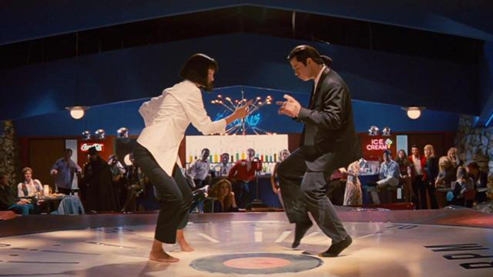
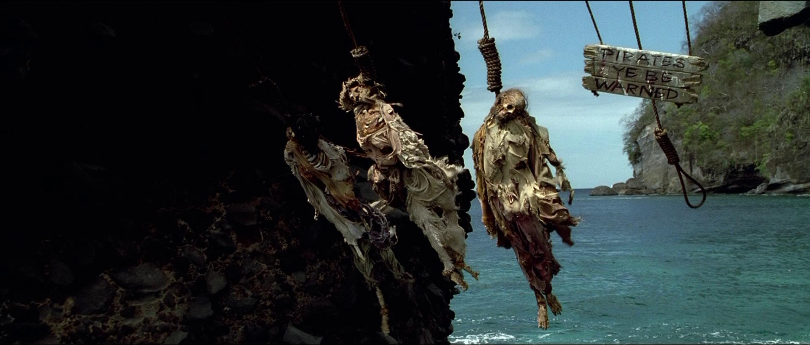

## 🔥 Premise
This was my first scavenger hunt where I incorporated my web skills with puzzles! I used GitHub pages to host each clue and then went back and created a homepage explaining each clue ->[vlcolquett.github.io/scavenger](https://vlcolquett.github.io/scavenger/)

Style is derived from Phantom by [HML5 UP](https://html5up.net).
## 🔰 Quick Notes
I built this while I was procrastinating grad school finals. Some methods are rough or can be deemed as shoddy implementations, but the functionality worked and my friends had a whole lot of fun with the puzzles and hunting. My skills have grown since this project and continue to grow with all of my new ideas, but I keep these live as fun reminders of where I started 😄
  
## 🎯Features
<details>
<summary>Minimal Security</summary>
I used this script at the bottom of every HTML page, because I had QR codes in public spaces. This script blocked the page until the password 'banana' was tyoed into the alert and if the password was wrong, the page redirected to get Rick Rolled. 
  ```html
  <script language="JavaScript">
    var password; 
    var pass1="banana"; 
    password=prompt('This is for a scavenger hunt. Please email scavengethehunt@gmail.com for questions or concerns. Enter Password'); 
    if (password==pass1) {
    alert('Correct Password! Click OK to Enter!') }
    else { window.location="https://youtu.be/dQw4w9WgXcQ"; 
    } 
  </script>
```
While this is minimal security, I use this method, because I still do not have any real information in this scavenger hunt because I use GitHub pages for the entire thing. This means all of the information is already on the client side anyway. 
</details>
<details>
<summary>Drag and Drop</summary>
A very crude method of drag and drop. Clue 6 uses this method and I found out it does not work on all web browsers, particularly those native to android phones. The answers only get checked when a user clicks the upper left button to call the function dragAndDrop().

```javascript
function dragAndDrop(){
    div11 = document.getElementById("div11").innerHTML.toString()
    div12 = document.getElementById("div12").innerHTML.toString()
    div13 = document.getElementById("div13").innerHTML.toString()
    div14 = document.getElementById("div14").innerHTML.toString()
    div15 = document.getElementById("div15").innerHTML.toString()
    div16 = document.getElementById("div16").innerHTML.toString()
    div17 = document.getElementById("div17").innerHTML.toString()
    div18 = document.getElementById("div18").innerHTML.toString()
    div19 = document.getElementById("div19").innerHTML.toString()
    div20 = document.getElementById("div20").innerHTML.toString()

    div1 = ''
    div2 = ''
    div3 = ''
    div4 = ''
    div5 = ''
    div6 = ''
    div7 = ''
    div8 = ''
    div9 = ''
    div10 = ''
    console.log(div11)
    console.log(div1)
    if(div11 == div1 && div12 == div3 && div13 == div8 && div14 == div5 && div15 ==
        div7 && div16 == div10 && div17 == div9 && div18 == div4 && div19 == div6 && div20 == div2){
            location.replace("https://vlcolquett.github.io/scavenger/clue7.html")
    }else{
        alert("seems like you haven't figured it out yet")
    }
}
```
</details>